# Assessment 02 - Kubernetes, MetalLB y Traefik

## Informacion general

**Nombre:** Angel Santiago Urbina Lopez  
**Iniciales:** ASUL  
**Namespace de trabajo:** `parcial-asul`

En esta practica se implemento un entorno local de Kubernetes utilizando Minikube, con el objetivo de publicar cuatro aplicaciones web diferentes utilizando una unica direccion IP proporcionada por MetalLB.

Para realizar la practica se utilizaron las siguientes tecnologias:

- Kubernetes
- Minikube
- Docker Desktop
- MetalLB
- Traefik
- Helm
- NGINX
- Windows Hosts

La arquitectura permite acceder a cuatro aplicaciones diferentes mediante nombres de dominio locales.

Traefik funciona como punto de entrada al cluster y determina a que aplicacion debe enviar cada solicitud dependiendo del nombre de dominio utilizado.

MetalLB proporciona la direccion IP utilizada por el servicio `LoadBalancer` de Traefik.

---

# Arquitectura

La arquitectura implementada utiliza una unica direccion IP externa para recibir las solicitudes destinadas a las cuatro aplicaciones.

```text
portal.asul.local
catalogo.asul.local
noticias.asul.local
soporte.asul.local
        |
        v
192.168.49.240
        |
        v
     MetalLB
        |
        v
     Traefik
        |
        v
      Ingress
   /    |    |    \
  v     v    v     v
Portal Catalogo Noticias Soporte
  |      |      |      |
Service Service Service Service
  |      |      |      |
 Pod    Pod    Pod    Pod
```

MetalLB asigna la direccion:

```text
192.168.49.240
```

al servicio `LoadBalancer` de Traefik.

Traefik recibe las solicitudes HTTP y analiza el nombre del host para enviarlas hacia el Service correspondiente.

Los cuatro Services de las aplicaciones son de tipo `ClusterIP`, por lo que permanecen internos dentro del cluster.

---

# 1. Verificacion inicial de Minikube

Primero se verifico que el cluster local de Minikube estuviera funcionando correctamente.

Se utilizaron los siguientes comandos:

```powershell
minikube status
minikube ip
kubectl get nodes -o wide
```

El estado obtenido fue:

```text
host: Running
kubelet: Running
apiserver: Running
kubeconfig: Configured
```

La direccion IP interna del nodo Minikube fue:

```text
192.168.49.2
```

El nodo se encontro en estado:

```text
Ready
```

### Evidencia

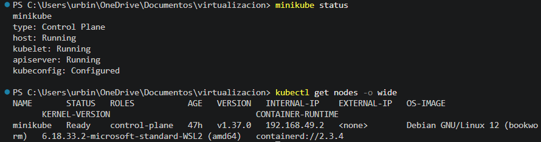

---

# 2. Verificacion de la red de Minikube

Antes de configurar MetalLB se verifico la red Docker utilizada por Minikube.

Se utilizo el comando:

```powershell
docker network inspect minikube
```

La configuracion principal encontrada fue:

```text
Subnet: 192.168.49.0/24
Gateway: 192.168.49.1
Minikube: 192.168.49.2
```

A partir de esta informacion se selecciono un rango dentro de la red `192.168.49.0/24` para que MetalLB pudiera asignar direcciones IP.

---

# 3. Namespaces utilizados

Para mantener separados los diferentes componentes se utilizaron tres namespaces principales:

```text
metallb-system
traefik
parcial-asul
```

Cada uno cumple una funcion diferente:

- `metallb-system`: contiene los componentes de MetalLB.
- `traefik`: contiene el Ingress Controller Traefik.
- `parcial-asul`: contiene las cuatro aplicaciones web, Services, ConfigMaps e Ingress.

Los namespaces pueden verificarse mediante:

```powershell
kubectl get namespaces
```

### Evidencia

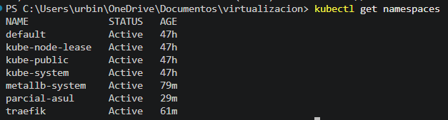

---

# 4. Instalacion de MetalLB

MetalLB fue instalado dentro del cluster utilizando su manifiesto oficial.

Se utilizo el siguiente comando:

```powershell
kubectl apply -f https://raw.githubusercontent.com/metallb/metallb/v0.14.9/config/manifests/metallb-native.yaml
```

Luego se verificaron sus componentes:

```powershell
kubectl get pods -n metallb-system
```

Los componentes principales quedaron en estado `Running`:

```text
controller
speaker
```

Esto confirmo que MetalLB se encontraba funcionando correctamente dentro del cluster.

### Evidencia

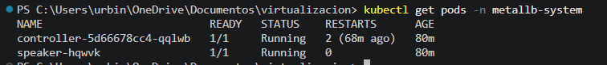

---

# 5. Configuracion del rango de direcciones de MetalLB

Para definir las direcciones que MetalLB podia asignar se creo el archivo:

```text
metallb/pool-red.yaml
```

La configuracion utilizada fue:

```yaml
apiVersion: metallb.io/v1beta1
kind: IPAddressPool
metadata:
  name: default-pool
  namespace: metallb-system
spec:
  addresses:
    - 192.168.49.240-192.168.49.250

---
apiVersion: metallb.io/v1beta1
kind: L2Advertisement
metadata:
  name: default-advertisement
  namespace: metallb-system
spec:
  ipAddressPools:
    - default-pool
```

El rango configurado fue:

```text
192.168.49.240 - 192.168.49.250
```

La configuracion puede aplicarse mediante:

```powershell
kubectl apply -f metallb\pool-red.yaml
```

Para verificar el pool:

```powershell
kubectl get ipaddresspools -n metallb-system
```

Para verificar el anuncio de capa 2:

```powershell
kubectl get l2advertisements -n metallb-system
```

El resultado mostro:

```text
default-pool
default-advertisement
```

### Evidencia

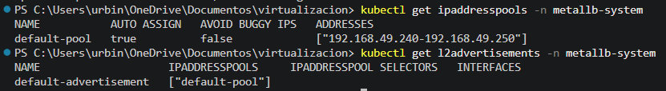

---

# 6. Instalacion de Traefik

Traefik fue utilizado como Ingress Controller para recibir las solicitudes HTTP y dirigirlas hacia cada aplicacion.

Primero se agrego el repositorio de Helm:

```powershell
helm repo add traefik https://traefik.github.io/charts
```

Luego se actualizaron los repositorios:

```powershell
helm repo update
```

Se creo el namespace:

```powershell
kubectl create namespace traefik
```

Traefik fue instalado mediante Helm utilizando un servicio de tipo `LoadBalancer`:

```powershell
helm install traefik traefik/traefik `
  --namespace traefik `
  --set service.type=LoadBalancer
```

La configuracion utilizada tambien se documento en:

```text
traefik/configuracion-traefik.yaml
```

Contenido:

```yaml
service:
  type: LoadBalancer

providers:
  kubernetesIngress:
    enabled: true
```

Para verificar la instalacion se utilizaron:

```powershell
helm list -A
kubectl get pods -n traefik
kubectl get svc -n traefik
```

MetalLB asigno correctamente la direccion:

```text
192.168.49.240
```

al servicio `LoadBalancer` de Traefik.

El resultado fue similar a:

```text
NAME      TYPE           EXTERNAL-IP
traefik   LoadBalancer   192.168.49.240
```

### Evidencia

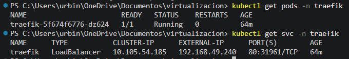

---

# 7. Creacion de las aplicaciones web

Las cuatro aplicaciones fueron creadas dentro del namespace:

```text
parcial-asul
```

Toda la configuracion se encuentra en:

```text
apps/servicios-web.yaml
```

Se crearon cuatro aplicaciones:

```text
portal
catalogo
noticias
soporte
```

Cada aplicacion cuenta con:

- Un `ConfigMap` con contenido HTML.
- Un `Deployment`.
- Un `Service` de tipo `ClusterIP`.

Los Deployments son:

```text
portal
catalogo
noticias
soporte
```

Los Services son:

```text
portal-service
catalogo-service
noticias-service
soporte-service
```

La configuracion fue aplicada mediante:

```powershell
kubectl apply -f apps\servicios-web.yaml
```

Luego se verificaron los Pods:

```powershell
kubectl get pods -n parcial-asul
```

Los cuatro Pods quedaron en estado:

```text
Running
```

Tambien se verificaron los Services:

```powershell
kubectl get svc -n parcial-asul
```

Todos los Services de las aplicaciones utilizan:

```yaml
type: ClusterIP
```

Esto significa que las aplicaciones no se encuentran directamente expuestas hacia el exterior.

El acceso se realiza exclusivamente mediante Traefik.

### Evidencia

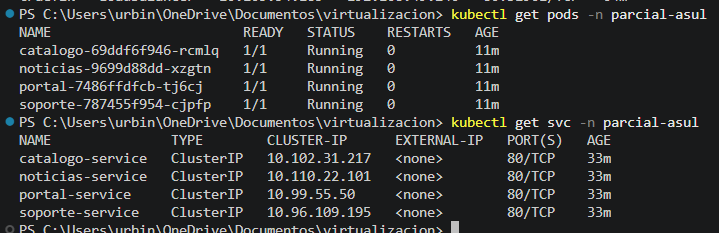

---

# 8. Contenido de las aplicaciones

Cada aplicacion muestra una pagina HTML diferente para facilitar la comprobacion del enrutamiento.

## Portal ASUL

```html
<h1>Portal ASUL</h1>
<p>Este servicio utiliza Kubernetes para el despliegue y Traefik para el enrutamiento.</p>
```

## Catalogo ASUL

```html
<h1>Catalogo ASUL</h1>
<p>Aplicacion web ejecutada en Kubernetes y publicada mediante Traefik.</p>
```

## Noticias ASUL

```html
<h1>Noticias ASUL</h1>
<p>Servicio administrado dentro del cluster de Kubernetes con acceso por medio de Traefik.</p>
```

## Soporte ASUL

```html
<h1>Soporte ASUL</h1>
<p>Aplicacion desplegada en Kubernetes y expuesta mediante el controlador Traefik.</p>
```

Los cuatro sitios utilizan NGINX para servir el contenido HTML.

---

# 9. Configuracion de Ingress

Para permitir el acceso a las aplicaciones mediante diferentes nombres de dominio se crearon cuatro recursos `Ingress`.

La configuracion se encuentra en:

```text
apps/rutas-ingress.yaml
```

Los dominios utilizados fueron:

```text
portal.asul.local
catalogo.asul.local
noticias.asul.local
soporte.asul.local
```

Cada dominio dirige el trafico hacia un Service diferente.

La configuracion fue aplicada mediante:

```powershell
kubectl apply -f apps\rutas-ingress.yaml
```

Para verificar los recursos Ingress:

```powershell
kubectl get ingress -n parcial-asul
```

El resultado mostro:

```text
NAME               CLASS     HOSTS                 ADDRESS
catalogo-ingress   traefik   catalogo.asul.local   192.168.49.240
noticias-ingress   traefik   noticias.asul.local   192.168.49.240
portal-ingress     traefik   portal.asul.local     192.168.49.240
soporte-ingress    traefik   soporte.asul.local    192.168.49.240
```

Los cuatro Ingress utilizan la misma direccion:

```text
192.168.49.240
```

Esto demuestra que no es necesario utilizar una direccion IP diferente para cada aplicacion.

Traefik identifica el destino mediante el nombre del host.

### Evidencia

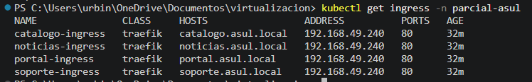

---

# 10. Verificacion interna del enrutamiento

Antes de realizar las pruebas desde Windows se verifico el funcionamiento directamente desde Minikube.

Para Portal se utilizo:

```powershell
minikube ssh -- curl --resolve portal.asul.local:80:192.168.49.240 http://portal.asul.local
```

Para Catalogo:

```powershell
minikube ssh -- curl --resolve catalogo.asul.local:80:192.168.49.240 http://catalogo.asul.local
```

Para Noticias:

```powershell
minikube ssh -- curl --resolve noticias.asul.local:80:192.168.49.240 http://noticias.asul.local
```

Para Soporte:

```powershell
minikube ssh -- curl --resolve soporte.asul.local:80:192.168.49.240 http://soporte.asul.local
```

Las cuatro solicitudes fueron respondidas correctamente.

Esto comprobo el funcionamiento del flujo:

```text
MetalLB
   |
   v
Traefik
   |
   v
Ingress
   |
   v
Service
   |
   v
Pod
```

---

# 11. Configuracion de DNS local en Windows

Debido a que se utilizaron dominios locales, fue necesario modificar el archivo `hosts` de Windows.

El archivo se encuentra en:

```text
C:\Windows\System32\drivers\etc\hosts
```

Debido al aislamiento de red existente entre Windows, Docker Desktop y Minikube, la direccion `192.168.49.240` funciona correctamente dentro de la red del cluster, pero no era directamente accesible desde el navegador del host Windows.

Por esta razon se utilizo un `port-forward` hacia Traefik para realizar las pruebas desde el navegador.

Se ejecuto:

```powershell
kubectl port-forward -n traefik service/traefik 80:80
```

Luego se configuraron los siguientes dominios en el archivo `hosts`:

```text
127.0.0.1 portal.asul.local
127.0.0.1 catalogo.asul.local
127.0.0.1 noticias.asul.local
127.0.0.1 soporte.asul.local
```

Posteriormente se limpio la cache DNS de Windows:

```powershell
ipconfig /flushdns
```

El uso de `127.0.0.1` se realiza unicamente para permitir que el navegador de Windows acceda al `port-forward`.

Dentro del cluster, Traefik continua utilizando la direccion proporcionada por MetalLB:

```text
192.168.49.240
```

### Evidencia

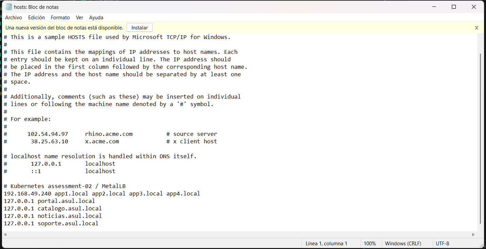

---

# 12. Prueba desde navegador - Portal

La primera aplicacion fue accedida utilizando:

```text
http://portal.asul.local
```

Traefik identifico el host:

```text
portal.asul.local
```

y envio la solicitud hacia:

```text
portal-service
```

La pagina mostrada contiene:

```text
Portal ASUL

Este servicio utiliza Kubernetes para el despliegue y Traefik para el enrutamiento.
```

### Evidencia

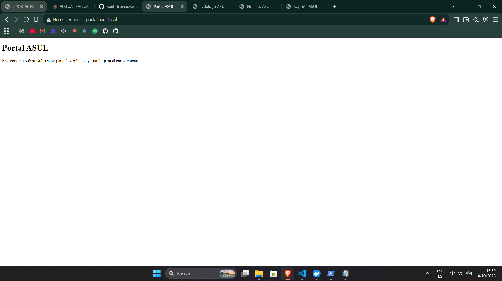

---

# 13. Prueba desde navegador - Catalogo

La segunda aplicacion fue accedida utilizando:

```text
http://catalogo.asul.local
```

Traefik redirigio la solicitud hacia:

```text
catalogo-service
```

La pagina mostrada contiene:

```text
Catalogo ASUL

Aplicacion web ejecutada en Kubernetes y publicada mediante Traefik.
```

### Evidencia

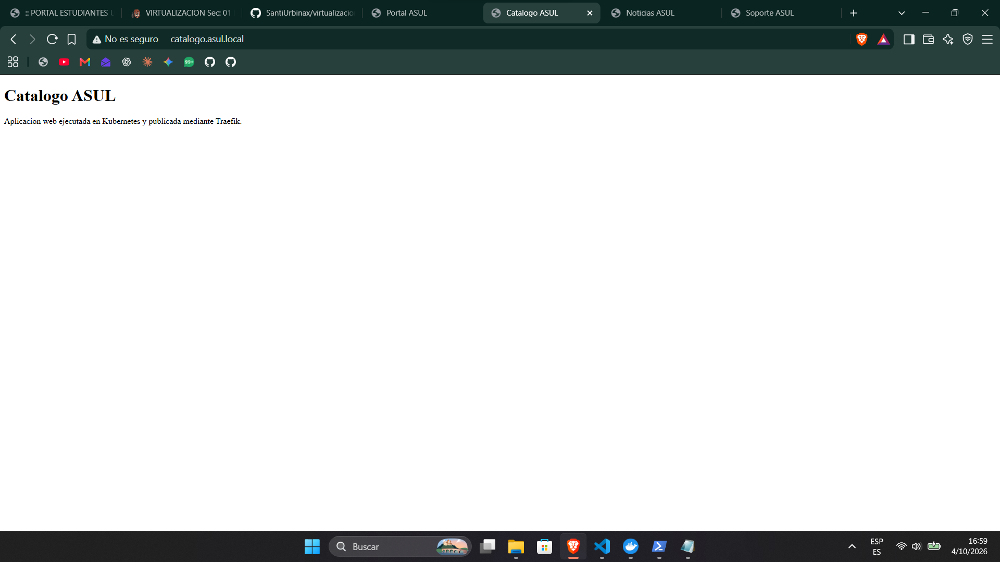

---

# 14. Prueba desde navegador - Noticias

La tercera aplicacion fue accedida utilizando:

```text
http://noticias.asul.local
```

Traefik dirigio la solicitud hacia:

```text
noticias-service
```

La pagina mostrada contiene:

```text
Noticias ASUL

Servicio administrado dentro del cluster de Kubernetes con acceso por medio de Traefik.
```

### Evidencia

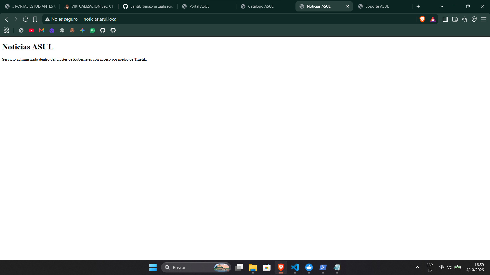

---

# 15. Prueba desde navegador - Soporte

La cuarta aplicacion fue accedida utilizando:

```text
http://soporte.asul.local
```

Traefik envio la solicitud hacia:

```text
soporte-service
```

La pagina mostrada contiene:

```text
Soporte ASUL

Aplicacion desplegada en Kubernetes y expuesta mediante el controlador Traefik.
```

### Evidencia

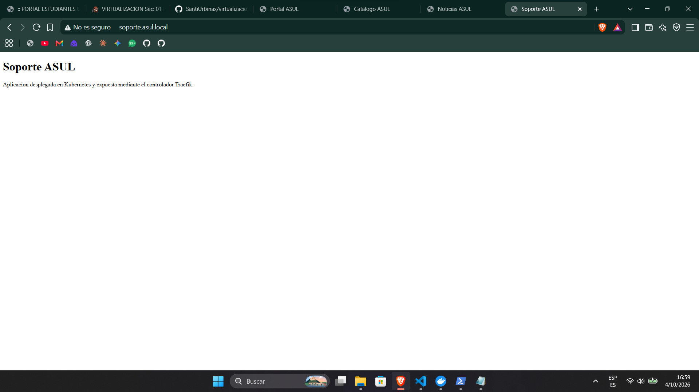

---

# 16. Estructura del proyecto

La estructura final utilizada en el repositorio es:

```text
virtualizacion/
│
├── apps/
│   ├── servicios-web.yaml
│   └── rutas-ingress.yaml
│
├── metallb/
│   └── pool-red.yaml
│
├── traefik/
│   └── configuracion-traefik.yaml
│
├── img/
│   ├── 01-minikube.png
│   ├── 02-namespaces.png
│   ├── 03-metallb.png
│   ├── 04-metallb-pool.png
│   ├── 05-traefik.png
│   ├── 06-aplicaciones.png
│   ├── 07-ingress.png
│   ├── 08-hosts.png
│   ├── 09-portal.png
│   ├── 10-catalogo.png
│   ├── 11-noticias.png
│   └── 12-soporte.png
│
└── README.md
```

---

# 17. Resultado final

Se implementaron cuatro aplicaciones web independientes dentro de Kubernetes.

Las cuatro aplicaciones utilizan una unica direccion IP asignada por MetalLB al servicio `LoadBalancer` de Traefik:

```text
192.168.49.240
```

La relacion entre dominios, Services y Deployments es:

| Dominio | Service | Deployment |
|---|---|---|
| `portal.asul.local` | `portal-service` | `portal` |
| `catalogo.asul.local` | `catalogo-service` | `catalogo` |
| `noticias.asul.local` | `noticias-service` | `noticias` |
| `soporte.asul.local` | `soporte-service` | `soporte` |

Los cuatro Services permanecen como `ClusterIP`.

Traefik es el unico punto de entrada para las aplicaciones y utiliza las reglas de Ingress para determinar el destino de cada solicitud.

---

# Conclusion

La practica permitio implementar una arquitectura de publicacion de servicios en Kubernetes utilizando MetalLB y Traefik.

MetalLB permitio proporcionar una direccion IP al servicio `LoadBalancer` de Traefik:

```text
192.168.49.240
```

Traefik permitio utilizar cuatro nombres de dominio diferentes utilizando una unica direccion IP, enviando cada solicitud hacia el Service correspondiente mediante reglas de Ingress.

Las aplicaciones se encuentran dentro del namespace:

```text
parcial-asul
```

mientras que MetalLB y Traefik utilizan namespaces independientes.

La arquitectura final permite centralizar el acceso a las aplicaciones mediante Traefik, manteniendo los Services internos como `ClusterIP` y utilizando una unica direccion proporcionada por MetalLB.
