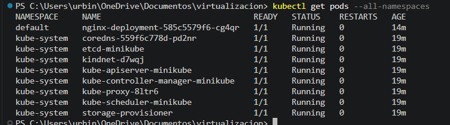
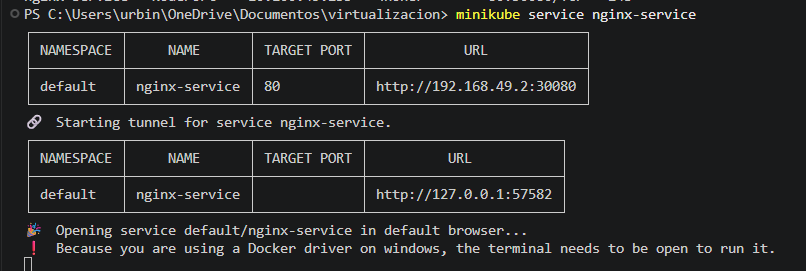
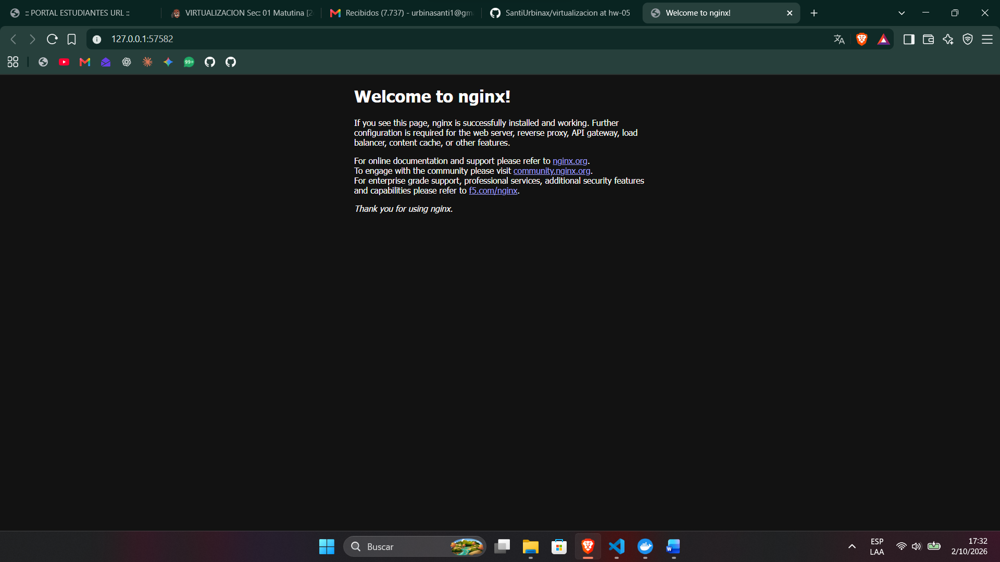
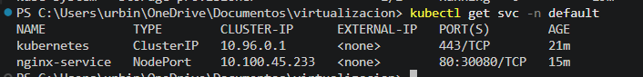

# HW-05 - Kubernetes Service

## Descripción

En esta actividad se configuró un Deployment de Nginx en Kubernetes y se expuso mediante un Service de tipo `NodePort`.

La configuración se realizó utilizando Infrastructure as Code (IaC) mediante archivos YAML.

## Archivos utilizados

- `k8s/deployment.yaml`
- `k8s/service.yaml`

## Deployment

El `Deployment` llamado `nginx-deployment` crea y mantiene una instancia de Nginx dentro del clúster de Kubernetes.

Características principales:

- Utiliza la imagen `nginx:latest`.
- Ejecuta 1 réplica del contenedor.
- Expone el puerto `80` dentro del contenedor.
- Utiliza la etiqueta `app: nginx` para identificar los Pods administrados por el Deployment.

Para aplicar el Deployment se utilizó:

```bash
kubectl apply -f k8s/deployment.yaml
```

## Service

El `Service` llamado `nginx-service` permite acceder al servidor Nginx desplegado dentro de Kubernetes.

Características principales:

- Tipo de servicio: `NodePort`.
- Protocolo: `TCP`.
- Puerto del servicio: `80`.
- Puerto del contenedor: `80`.
- NodePort configurado: `30080`.
- Selector utilizado: `app: nginx`.

Para aplicar el Service se utilizó:

```bash
kubectl apply -f k8s/service.yaml
```

## Resultado

La configuración permite ejecutar Nginx dentro del clúster de Kubernetes y acceder al servicio desde el navegador local utilizando Minikube.

# Evidencias

## Namespace y Pod en ejecución

Se verificó que el Pod de Nginx se encuentra en ejecución dentro del namespace `default`.



## Acceso al servicio mediante Minikube

Para exponer el servicio y acceder desde el equipo local se utilizó:

```bash
minikube service nginx-service
```

Minikube generó una URL local que permite acceder al servicio desde el navegador.



## Acceso al servicio desde el navegador

Se realizó la llamada al servicio de Nginx desde el navegador local, verificando que el servidor responde correctamente.



## Salida de `kubectl get svc`

Se verificó el Service configurado en el namespace `default` utilizando el comando:

```bash
kubectl get svc -n default
```

La salida muestra el servicio `nginx-service` configurado como `NodePort` y exponiendo el puerto `30080`.



## Estructura del proyecto

```text
.
├── images
│   ├── kubectl.png
│   ├── minikube-service.png
│   ├── namespace-pods.png
│   └── navegador-nginx.png
├── k8s
│   ├── deployment.yaml
│   └── service.yaml
└── README.md
```

## Rama utilizada

La rama utilizada para esta evaluación es:

```text
hw-05
```

La rama fue creada a partir de `main`.